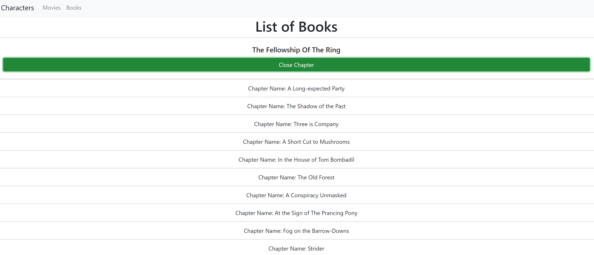
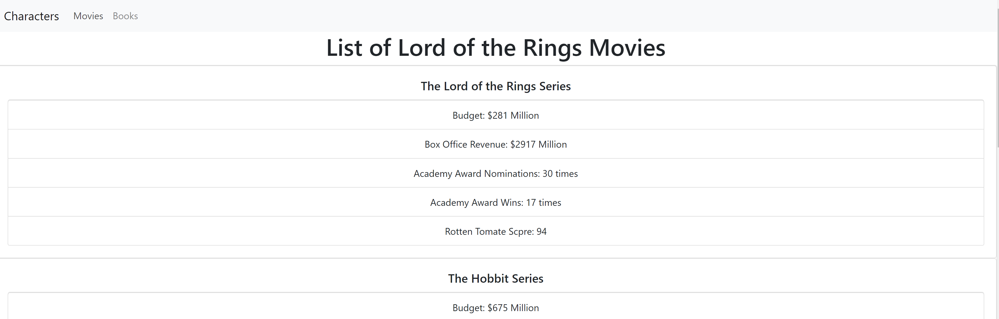
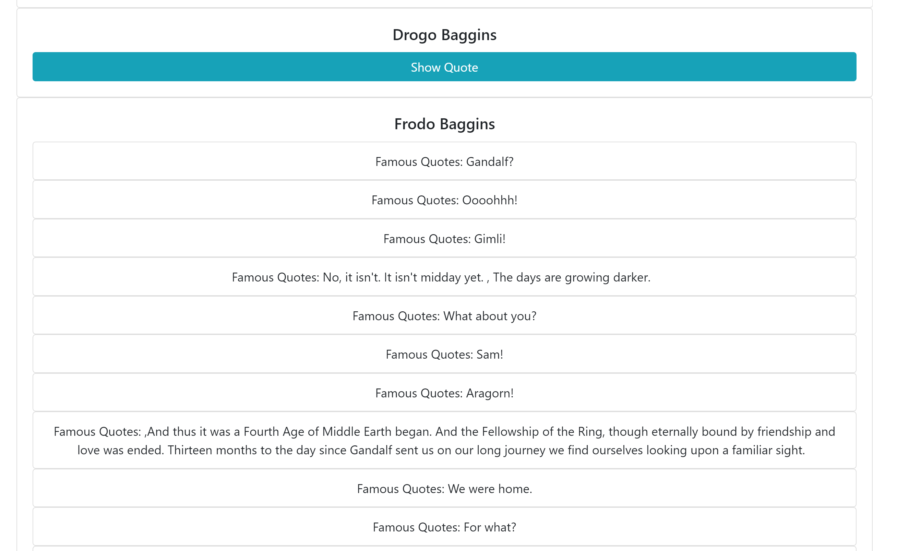

# Lord of the Rings API - using React

https://cs-lotr-api.netlify.app/

## Screenshot
Character page shows LOTR characters and when you click button, shows the character's quotes. (Not all characters have quotes.)
Movie page shows all the details about each LOTR movie.
Book page shows all the books and chapters with button click.

<ul>
  <li></li>
  <li></li>
  <li></li>
</ul>
